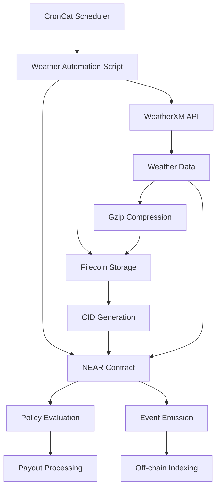

# CronCat Automation System

This document provides comprehensive documentation for the AgriGuard CronCat automation system that enables 3-hourly weather checks and automatic policy claim processing.

## Overview

The automation system integrates CronCat with AgriGuard to provide:
- **Automated Weather Data Collection**: Every 3 hours from WeatherXM API
- **Filecoin Storage**: Immutable storage of weather data with CID generation
- **On-Chain Integration**: Weather data and CIDs stored on NEAR blockchain
- **Policy Claim Processing**: Automatic payout triggers when rainfall thresholds aren't met
- **Event Logging**: Comprehensive tracking of all automation activities

## Architecture



## Components

### 1. Weather Automation Script (`scripts/automateWeatherChecks.ts`)
- **Primary automation logic**
- Integrates with WeatherXM API, Filecoin, and NEAR
- Handles policy evaluation and payout processing
- Provides CLI interface for management

### 2. Policy Setup Script (`scripts/setupTestPolicies.ts`)
- **Creates test insurance policies**
- Generates diverse scenarios for testing
- Provides policy management utilities

### 3. Smart Contract Extensions
- **New methods for automation support**
- Policy management and claim processing
- Enhanced event logging for monitoring

## Installation & Setup

### 1. Install CronCat CLI

```bash
npm install -g croncat
```

### 2. Environment Configuration

Update your `.env` file with automation variables:

```bash
# NEAR Configuration for Automation
NEAR_ACCOUNT_ID=your_near_account.testnet
NEAR_CONTRACT_ID=your_contract.testnet
NEAR_NETWORK_ID=testnet

# CronCat Configuration
CRONCAT_AGENT_ID=your_croncat_agent.testnet
CRONCAT_MANAGER_CONTRACT=manager.croncat.testnet

# Existing WeatherXM and Web3.Storage configs
WEATHERXM_API_KEY=your_weatherxm_api_key
WEB3_STORAGE_TOKEN=your_web3_storage_token
```

### 3. Deploy Updated Contract

```bash
cd agriguard-js
npm run build
npm run deploy
```

### 4. Setup Test Policies

```bash
# Create test policies for simulation
npm run setup-policies create

# View created policies
npm run setup-policies list

# Generate policy summary
npm run setup-policies summary
```

## Usage

### Manual Weather Check

Test the weather data collection and policy processing manually:

```bash
# Check weather for default station
npm run automate check-weather

# Check weather for specific station
npm run automate check-weather WXM_STATION_002
```

### Create CronCat Task

Set up automated 3-hourly weather checks:

```bash
npm run automate create-task
```

This creates a CronCat task with:
- **Schedule**: Every 3 hours (`0 */3 * * *`)
- **Function**: `automated_weather_check`
- **Gas**: 300 TGas
- **Deposit**: 5 NEAR for execution fees

### Check CronCat Status

Monitor active tasks and agent status:

```bash
npm run automate status
```

### Simulation Mode

Run a compressed simulation to test the full automation cycle:

```bash
# 12-hour simulation (default)
npm run automate simulate

# Custom duration (hours)
npm run automate simulate 6

# Quick 1-hour test
npm run automate simulate 1
```

**Simulation Features:**
- Compressed timescale (1 minute = 3 hours in real time)
- Multiple weather data points with varying rainfall
- Policy payout triggers when thresholds aren't met
- Comprehensive reporting at completion

## Automation Workflow

### 1. Weather Data Collection
```typescript
// Every 3 hours, the system:
1. Fetches weather data from WeatherXM API
2. Compresses data using gzip (70-85% reduction)
3. Stores compressed data on Filecoin
4. Generates Content Identifier (CID)
```

### 2. On-Chain Storage
```typescript
// Weather data and CID stored on NEAR:
- stationId: 'WXM_STATION_001'
- timestamp: ISO 8601 format
- rainfall_mm: Actual rainfall measurement
- filecoinCid: IPFS CID for verification
```

### 3. Policy Evaluation
```typescript
// For each active policy:
if (actualRainfall < policy.rainfallThreshold) {
  // Trigger payout
  policy.status = 'Paid'
  // Process USDC transfer
  // Log payout event
}
```

### 4. Event Logging
```typescript
// Structured JSON events emitted:
- AUTOMATED_WEATHER_CHECK
- WEATHER_DATA_STORED
- POLICY_PAYOUT
- POLICY_STATUS_CHANGE
```

## Testing & Validation

### 1. Contract Methods

Test individual contract methods:

```bash
# Test weather data submission
near call your_contract.testnet receive_weather '{
  "station_id": "WXM_STATION_001",
  "timestamp": "2024-01-15T12:00:00Z",
  "rainfall_mm": 25,
  "filecoin_cid": "bafybeih..."
}' --accountId your_account.testnet --amount 1

# Check policy status
near view your_contract.testnet get_policies '{
  "station_id": "WXM_STATION_001",
  "status": "Active"
}'
```

### 2. Filecoin Verification

Verify weather data accessibility:

```bash
# Direct IPFS gateway access
curl https://w3s.link/ipfs/YOUR_CID

# Verify data integrity
npm run weather:store WXM_STATION_001
```

### 3. Policy Simulation

Test different rainfall scenarios:

```typescript
// Low rainfall (triggers payout)
rainfall_mm: 15 // Below 30mm threshold

// Normal rainfall (no payout)
rainfall_mm: 45 // Above 30mm threshold

// High rainfall (no payout)
rainfall_mm: 80 // Well above threshold
```

## Monitoring & Analytics

### Event Tracking

Monitor automation events in NEAR Explorer:

```bash
# Search for events by transaction hash
https://testnet.nearblocks.io/txns/TRANSACTION_HASH

# Filter by event type
AUTOMATED_WEATHER_CHECK
POLICY_PAYOUT
WEATHER_DATA_STORED
```

### Policy Statistics

Generate comprehensive reports:

```bash
# Overall statistics
npm run automate report

# Policy summary
npm run setup-policies summary
```

### Expected Output:
```
📊 SIMULATION REPORT
==================
📡 Weather data points collected: 12
📊 Total policies: 5
💰 Paid policies: 2
🟢 Active policies: 3
💸 Total payouts: $8,000
```

## Cost Analysis

### Gas Costs (per execution)
- **Weather data submission**: ~50 TGas (~0.005 NEAR)
- **Policy claim processing**: ~100 TGas (~0.01 NEAR)
- **CronCat execution fee**: ~0.1 NEAR per task

### Storage Costs
- **Filecoin storage**: ~$0.001 per weather data point
- **NEAR storage**: ~0.0001 NEAR per data entry

### Total Monthly Cost (8 executions/day)
- **Execution**: ~24 NEAR/month
- **Storage**: ~$2.40/month (Filecoin)
- **Total**: ~$125/month at current NEAR prices

## Troubleshooting

### Common Issues

1. **CronCat Task Creation Fails**
   ```bash
   # Ensure account has sufficient balance
   near state your_account.testnet
   
   # Check CronCat agent registration
   croncat status your_account.testnet
   ```

2. **Weather Data Fetch Errors**
   ```bash
   # Verify WeatherXM API key
   curl -H "Authorization: Bearer $WEATHERXM_API_KEY" \
        https://api.weatherxm.com/api/v1/me
   
   # Test manual weather fetch
   npm run weather:store
   ```

3. **Filecoin Storage Issues**
   ```bash
   # Verify Web3.Storage credentials
   npm run test:filecoin
   
   # Check storage quota
   w3 space ls
   ```

4. **Contract Method Failures**
   ```bash
   # Check contract deployment
   near state your_contract.testnet
   
   # Verify method exists
   near view your_contract.testnet get_policies '{}'
   ```

### Debug Mode

Enable verbose logging for troubleshooting:

```bash
# Set debug environment
export DEBUG=agriguard:*

# Run with detailed logs
npm run automate simulate 1
```

## Security Considerations

### Access Control
- Contract methods protected by predecessor account checks
- CronCat tasks limited to pre-approved function calls
- Policy payouts require valid weather data and CIDs

### Data Integrity
- Weather data cryptographically verified via Filecoin CIDs
- Immutable storage prevents data tampering
- On-chain events provide audit trail

### Economic Security
- Policy payouts backed by contract balance
- Rainfall thresholds prevent manipulation
- Gas limits prevent DOS attacks

## Advanced Configuration

### Custom Schedules

Modify automation frequency:

```typescript
// Every hour: '0 * * * *'
// Every 6 hours: '0 */6 * * *'
// Daily at noon: '0 12 * * *'
// Custom cadence in CronCat task creation
```

### Multi-Station Support

Configure multiple weather stations:

```typescript
const stations = [
  'WXM_STATION_001',
  'WXM_STATION_002', 
  'WXM_STATION_003'
];

// Parallel processing
await Promise.all(
  stations.map(id => processWeatherAndPolicies(id))
);
```

### Policy Templates

Create policy templates for different crops:

```typescript
const templates = {
  corn: { rainfallThreshold: 50, coverageMultiplier: 1.2 },
  wheat: { rainfallThreshold: 30, coverageMultiplier: 1.0 },
  rice: { rainfallThreshold: 80, coverageMultiplier: 1.5 }
};
```

## API Reference

### WeatherAutomation Class

```typescript
class WeatherAutomation {
  // Initialize NEAR connection
  async init(): Promise<void>
  
  // Store weather data on Filecoin
  async storeWeatherData(stationId: string): Promise<WeatherData>
  
  // Submit weather data to contract
  async submitWeatherToContract(data: WeatherData): Promise<void>
  
  // Process weather and check policies
  async processWeatherAndPolicies(stationId: string): Promise<void>
  
  // Check for policy payouts
  async checkPolicyPayouts(data: WeatherData): Promise<void>
  
  // Create CronCat automation task
  async createCronTask(): Promise<void>
  
  // Run simulation for testing
  async simulateAutomation(hours: number): Promise<void>
  
  // Generate comprehensive report
  async generateSimulationReport(): Promise<void>
}
```

### Contract Methods

```rust
// Weather data submission
pub fn receive_weather(
  station_id: String,
  timestamp: String, 
  rainfall_mm: f64,
  filecoin_cid: String
) -> bool

// Policy claim processing
pub fn process_policy_claims(
  policy_id: String,
  actual_rainfall: f64,
  weather_cid: String,
  trigger_timestamp: String
) -> bool

// Automated trigger point
pub fn automated_weather_check(
  station_id: Option<String>
) -> void
```

## Future Enhancements

### Planned Features
- **Multi-region support**: Additional weather station integration
- **Advanced analytics**: ML-based weather prediction
- **Mobile notifications**: Real-time payout alerts
- **Governance integration**: Community-managed parameters

### Integration Opportunities
- **DeFi protocols**: Yield farming with policy premiums
- **Oracle networks**: Additional weather data sources
- **Cross-chain**: Ethereum and Polygon deployment
- **Mobile apps**: Farmer-facing applications

## Support

### Resources
- **Documentation**: `/docs` directory
- **Examples**: `/scripts` directory
- **Tests**: `/agriguard-js/sandbox-test`

### Community
- **GitHub Issues**: Bug reports and feature requests
- **Discord**: Real-time support and discussions
- **Documentation**: Comprehensive guides and tutorials

### Professional Support
For production deployments, enterprise features, or custom integrations, contact the AgriGuard team for professional support and consulting services. 